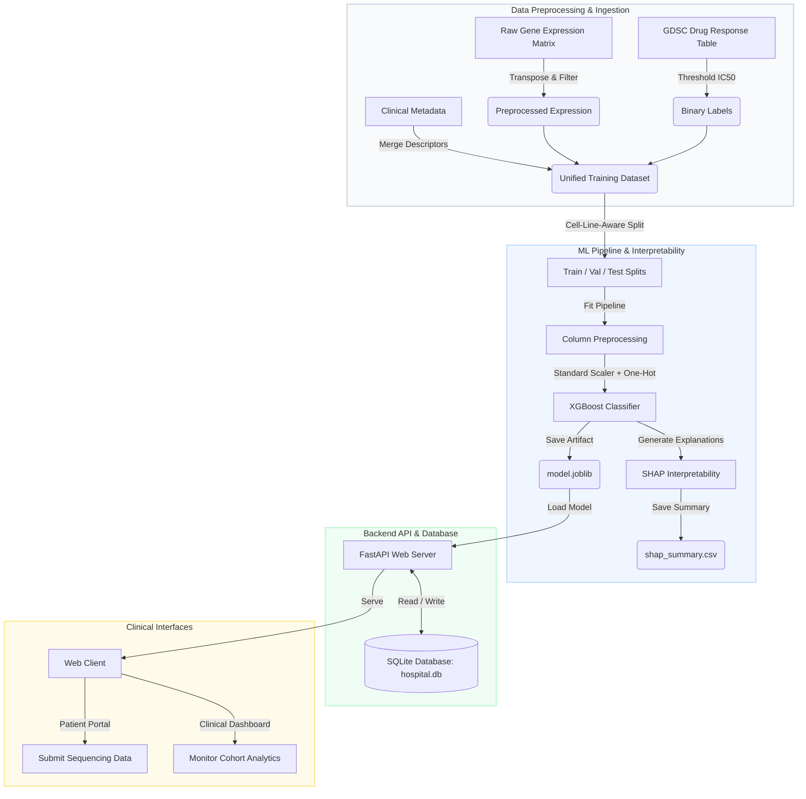
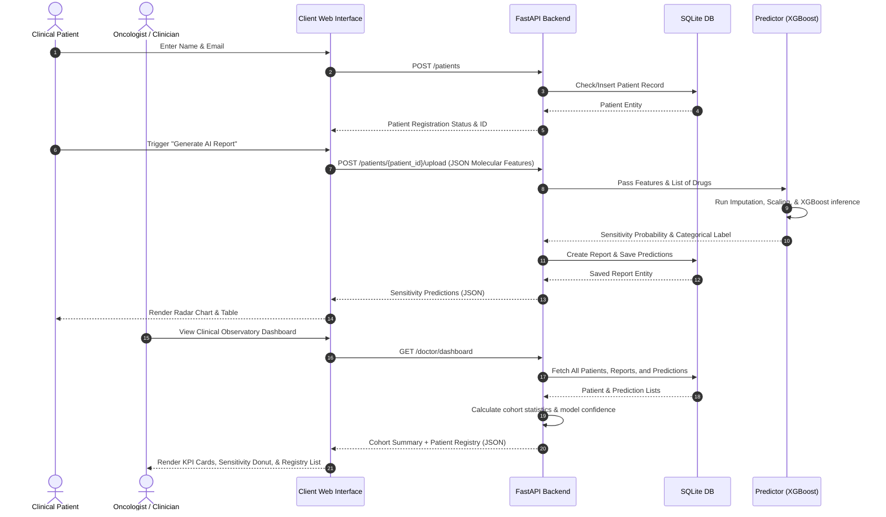
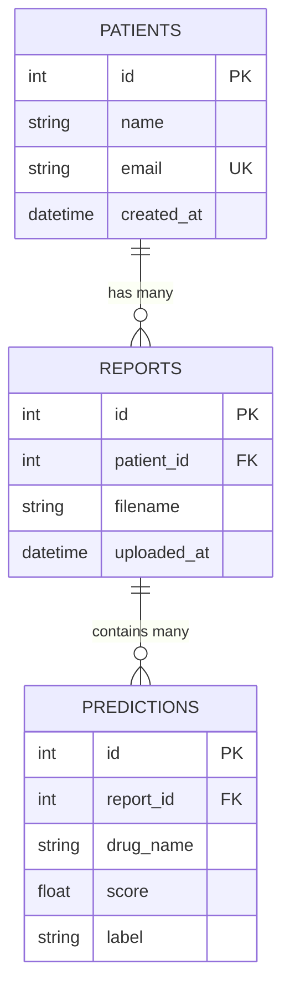

# Precision Oncology AI Platform: GDSC Drug Response Pipeline

Welcome to the **GDSC Drug Response Prediction Platform**, an end-to-end precision medicine solution. This platform leverages genomic profiles and clinical metadata to predict cancer cell line sensitivities to therapeutic compounds, translating complex biological data into actionable clinical decisions.

The project integrates a robust machine learning pipeline (built with scikit-learn and XGBoost), a secure SQLite database managed via SQLAlchemy, a FastAPI backend service, and an interactive modern web interface featuring a **Patient Portal** and a **Clinical Dashboard**.

---

## 1. System Architecture

The platform follows a modular architecture separating raw data ingestion, feature engineering, model training, persistence, API serving, and client visualization.



---

## 2. Information Flow: Sequence Diagram

Below is the workflow sequence when a patient is registered, submits a molecular profile, and the clinician reviews the therapeutic recommendations in the Clinical Observatory.



---

## 3. Database Schema (Entity-Relationship)

The system manages cohort data, files, and predictions using SQLite. Relationships are declared using SQLAlchemy's modern mapped classes.



### Table Definitions

1. **`patients`**: Stores subject profiles enrolled in the clinical trials. The email field enforces unique trial subjects.
2. **`reports`**: Stores metadata regarding uploaded clinical molecular sequences. Every upload registers a new report.
3. **`predictions`**: Stores inference outputs mapping drugs to their sensitivity probabilities (`score`) and categorical evaluations (`label`: *Sensitive* vs. *Resistant*).

---

## 4. Key Pipeline Components

### A. Preprocessing (`data.py`)
- **Expression Matrix Transposition**: The GDSC gene expression matrix lists genes as rows and cell lines as columns. The pipeline transposes this to a standard samples-as-rows format.
- **Top Variable Genes Selection**: To reduce dimensionality and focus on informative genomic markers, the pipeline can keep only the top `n` genes based on variance.
- **IC50 Thresholding**: Raw IC50 values (or LN_IC50 values) are converted into binary classification labels (*1* for Sensitive, *0* for Resistant) by thresholding each drug's score at its cohort median.
- **Metadata Merging**: Incorporates clinical cell line tissue descriptors and micro-satellite instability status into the features.

### B. Machine Learning Modeling (`models.py`, `benchmarks.py`)
- **Cell-Line-Aware Splitting**: Standard random splitting introduces data leakage when rows from the same cell line (tested against different drugs) end up in both training and test sets. The pipeline prevents leakage by using `GroupShuffleSplit` on the `CELL_LINE_NAME`.
- **Column Transformers**:
  - *Numeric Features* (Genes): Missing values are imputed via median strategy, and features are standardized.
  - *Categorical Features* (Drugs, Tissue type): Imputed via most-frequent strategy and one-hot encoded.
- **Estimators Supported**:
  - `LogisticRegression` (with balanced class weights)
  - `RandomForestClassifier` (300 estimators, balanced subsample)
  - `XGBClassifier` (Gradient boosted trees optimized for logloss)
- **SHAP Explainability**: Integrates `SHAP` (SHapley Additive exPlanations) to compute feature importance summaries, ensuring clinicians can interpret the genomic features driving predicted responses.

### C. FastAPI Backend REST API (`api.py`)
Provides REST endpoints and handles database sessions and model inferences.
- **Dynamic Model Loading**: Detects and loads the highest-performing available model artifact (starting from `model.joblib` down to `release_baseline.joblib`).
- **Unified Prediction Routine**: Projects a patient's molecular profile across a clinical drug panel (e.g. *Cisplatin*, *Docetaxel*, *Erlotinib*) and returns sorted sensitivities.

---

## 5. REST API Documentation

### 1. Health Check
*   **Endpoint**: `GET /health`
*   **Description**: Verifies API server connectivity.
*   **Response**:
    ```json
    { "status": "ok" }
    ```

### 2. Patient Registration
*   **Endpoint**: `POST /patients`
*   **Request Body**:
    ```json
    {
      "name": "Jane Doe",
      "email": "jane.doe@hospital.io"
    }
    ```
*   **Response**:
    ```json
    {
      "id": 1,
      "name": "Jane Doe",
      "email": "jane.doe@hospital.io",
      "status": "created" // or "existing"
    }
    ```

### 3. Patient Molecular Feature Upload & Analysis
*   **Endpoint**: `POST /patients/{patient_id}/upload`
*   **Request Body**: Dictionary containing clinical descriptors and sequencing indicators.
    ```json
    {
      "TCGA_DESC": "LUAD",
      "GDSC Tissue descriptor 1": "lung",
      "Cancer Type (matching TCGA label)": "LUAD",
      "Screen Medium": "RPMI",
      "Gene Expression": "Y",
      "CNA": "Y",
      "Methylation": "Y"
    }
    ```
*   **Response**:
    ```json
    {
      "report_id": 12,
      "predictions": [
        {
          "drug_name": "Paclitaxel",
          "probability_sensitive": 0.842,
          "predicted_label": "Sensitive"
        },
        {
          "drug_name": "Gefitinib",
          "probability_sensitive": 0.315,
          "predicted_label": "Resistant"
        }
      ]
    }
    ```

### 4. Doctor Dashboard Summary
*   **Endpoint**: `GET /doctor/dashboard`
*   **Description**: Pulls diagnostic records, patient lists, and aggregate metrics.
*   **Response**:
    ```json
    {
      "patients": [
        {
          "patient_id": 1,
          "name": "Jane Doe",
          "email": "jane.doe@hospital.io",
          "latest_report_date": "2026-06-07T10:45:12.105432",
          "top_recommendations": [
            { "drug": "Paclitaxel", "score": 0.842 }
          ]
        }
      ],
      "stats": {
        "total_patients": 1,
        "population_sensitivity": 50.0,
        "most_sensitive_drug": "Paclitaxel",
        "model_confidence": 0.5785
      }
    }
    ```

---

## 6. Step-by-Step Execution Guide

### Step 1: Environment Setup
Ensure Python 3.10+ is installed. Clone the repository, navigate to the directory, and install dependencies:
```bash
# Install in editable mode
pip install -e .
```

### Step 2: Running Preprocessing & Model Training

#### Option A: Training with Full Genomics Data
If raw gene expression, drug response, and metadata matrices are present under `data/raw/`:
```bash
# 1. Preprocess and merge datasets
python -m gdsc_drug_response.cli preprocess \
  --expression data/raw/expression.tsv \
  --response data/raw/drug_response.tsv \
  --metadata data/raw/metadata.tsv \
  --output-dir data/processed

# 2. Train the XGBoost model
python -m gdsc_drug_response.cli train \
  --dataset data/processed/model_dataset.csv \
  --output-dir artifacts
```

#### Option B: Training with row-wise GDSC Release Tables (Baseline)
If using the default release tables provided in the repository under `dataset/`:
```bash
# Train the categorical baseline model
python -m gdsc_drug_response.cli train-release-baseline \
  --release dataset/GDSC_DATASET.csv \
  --compounds dataset/Compounds-annotation.csv \
  --output-dir artifacts/release_baseline
```

### Step 3: Run the Web Server
Launch the FastAPI application using Uvicorn:
```bash
python -m uvicorn gdsc_drug_response.api:app --host 127.0.0.1 --port 8000 --reload
```

### Step 4: Run the Test Suite
Verify that all API behaviors and database operations are fully functional:
```bash
python -m pytest
```

---

## 7. User Interface Guide

The frontend client is served statically at the root of the server (`http://127.0.0.1:8000/`) and consists of three views:

### A. Home Dashboard (`index.html`)
The landing page introduces the clinical trial context. It gives access to both portals:
- **Patient Portal**: The participant interface to register and request analysis.
- **Clinical Dashboard**: The doctor interface for aggregate observations.

### B. Patient Portal (`patient.html`)
1.  **Registration / Access Session**: Enter full name and email. The database generates a record or signs into an existing profile.
2.  **Upload Molecular Profile**: Click the drag-and-drop zone to upload a custom JSON profile (such as [demo_molecular_profile.json](file:///d:/DE_project/demo_molecular_profile.json)). 
    * If a multi-profile file is uploaded, a dropdown appears allowing the user to select which specific disease profile (e.g., *Lung Adenocarcinoma*, *Breast Carcinoma*) to simulate.
3.  **Generate AI Report**: Submits the selected molecular profile to the backend ML models.
4.  **Visualization**:
    *   **Radar Chart**: Interactively plots the patient's sensitivity probability across 6 key chemotherapeutic agents.
    *   **Detailed Table**: Lists predicted class indicators (*Sensitive* / *Resistant*) alongside the exact probability scores represented by progress bar meters.

### C. Clinical Dashboard (`doctor.html`)
Provides trial-wide metrics for cohort observation:
-   **KPI Summary**: Number of trial subjects, mean cohort sensitivity rate, and the primary target drug with the highest observed sensitivity.
-   **Population Analytics**: Doughnut chart representing population-wide therapeutic sensitivity split, alongside the overall model confidence indicator.
-   **Patient Registry**: A searchable list showing all registered trial subjects, enrollment status, most recent report generation date, and their top-3 recommended treatment targets.
